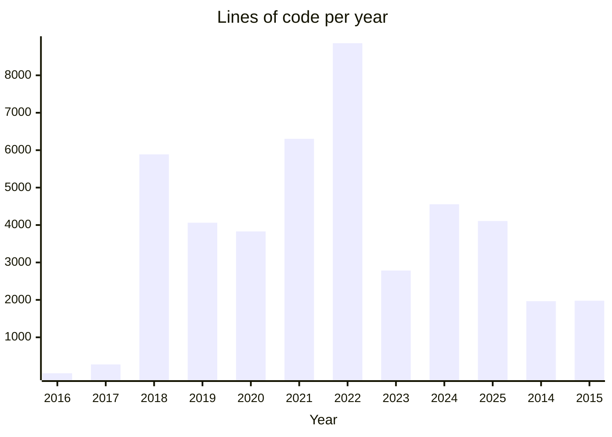

### Welcome to my profile ... 👋

My name is **Daniel Engvall**, and living in Sweden 🇸🇪 together with the rest of my family.
I use GitHub for my *personal* projects that include code and documentation, the majority of which is written in [Python](https://en.wikipedia.org/wiki/Python_(programming_language)) 🐍 together with technologies such as [Dockers](https://en.wikipedia.org/wiki/Docker_(software)), which is and has been one of my primary go-to programming languages after I've been exposed to other languages such as [Basic](https://en.wikipedia.org/wiki/BASIC), [C++](https://en.wikipedia.org/wiki/C%2B%2B), [Perl](https://en.wikipedia.org/wiki/Perl), [Pascal](https://en.wikipedia.org/wiki/Pascal_(programming_language)), and [PHP](https://en.wikipedia.org/wiki/PHP), none of them fell into my true taste. While I developed quite sophisticated solutions using [Bash](https://en.wikipedia.org/wiki/Bash_(Unix_shell)) that eventually got outgrown and I pursued a productive, dynamic, and full spectrum language to run well from anything from [microcontrollers](https://en.wikipedia.org/wiki/ESP32) and [embedded systems](https://en.wikipedia.org/wiki/Embedded_system)  (anyone ever had a [Dreambox](https://en.wikipedia.org/wiki/Dreambox) 📺..?) ..  [GUI apps](https://wiki.python.org/moin/GuiProgramming), even [mobile apps](https://kivy.org/), *web-frontend* development *(e.g. [PyScript](https://pyscript.net/))* and [statistical analysis](https://pandas.pydata.org/getting_started.html) to the scalable server application *([FastAPI](https://fastapi.tiangolo.com/) to name one of many)*. So, I have tried using **[Python](https://en.wikipedia.org/wiki/Python_(programming_language))** for the most versatile purposes. 😅👍

Also, home automation and microcontrollers (where) some of my projects found here include wiring schemes. 
Outside of my personal space, I've also used [Groovy/Java](Groovy/Java) and learned a lot from doing that.

A more recent growing passion for better understanding and writing more maintainable software using good practices and [software design](https://en.wikipedia.org/wiki/Software_design_pattern). Also had a strong devotion to documenting ideas and thoughts around those projects 🫶

Some facts about the current content are found on my GitHub - but feel free to check them out in detail over [here](https://github.com/engdan77?tab=repositories):

- During the past **11 years** have written **44649 lines of code** across **41 projects** collected here.
- Out of those projects written here, currently the **largest** ones are written with around 5k lines of code, currently at the top being [iot_fan_controller](https://github.com/engdan77/iot_fan_controller.git), [tasks_collector](https://github.com/engdan77/tasks_collector.git) and [otis_service](https://github.com/engdan77/otis_service.git)

This has been *<u>dynamically</u>* updated on **2025-07-31 11:34** with the help of Python and [GitHub Actions](https://docs.github.com/en/actions).

- 👀 LinkedIn profile https://www.linkedin.com/in/danielengvall/
- 📫 If you like to get in contact with me please send an email to daniel@engvalls.eu

Please visit my list of projects [here](https://github.com/engdan77?tab=repositories), and below a summary of those.

- **2025**: [images_to_pdf](https://github.com/images_to_pdf/images_to_pdf), [jamwatch](https://github.com/jamwatch/jamwatch), [wilmut_invader](https://github.com/wilmut_invader/wilmut_invader)
- **2024**: [count_code_lines](https://github.com/count_code_lines/count_code_lines), [engdan77.github.io](https://github.com/engdan77.github.io/engdan77.github.io), [femkamp](https://github.com/femkamp/femkamp), [mitm_youtube_repeller](https://github.com/mitm_youtube_repeller/mitm_youtube_repeller), [notebooks](https://github.com/notebooks/notebooks)
- **2023**: [alfons_timer](https://github.com/alfons_timer/alfons_timer), [ameliagpt](https://github.com/ameliagpt/ameliagpt), [memocast](https://github.com/memocast/memocast), [smartbox](https://github.com/smartbox/smartbox), [musicplayer](https://github.com/musicplayer/musicplayer)
- **2022**: [engdan77](https://github.com/engdan77/engdan77), [jokebox](https://github.com/jokebox/jokebox), [metrics_collector](https://github.com/metrics_collector/metrics_collector), [music_meta_manager](https://github.com/music_meta_manager/music_meta_manager), [python_mermaid](https://github.com/python_mermaid/python_mermaid), [olm_convert](https://github.com/olm_convert/olm_convert)
- **2021**: [cat_alarm](https://github.com/cat_alarm/cat_alarm), [mail_export](https://github.com/mail_export/mail_export), [mail_relay](https://github.com/mail_relay/mail_relay), [project_images](https://github.com/project_images/project_images), [raspberry_lab](https://github.com/raspberry_lab/raspberry_lab)
- **2020**: [iot_fan_controller](https://github.com/iot_fan_controller/iot_fan_controller), [evernote-to-sqlite](https://github.com/evernote-to-sqlite/evernote-to-sqlite)
- **2019**: [diy_robot](https://github.com/diy_robot/diy_robot), [dummy_screen](https://github.com/dummy_screen/dummy_screen), [esp32_buttons](https://github.com/esp32_buttons/esp32_buttons), [hass_assister](https://github.com/hass_assister/hass_assister)
- **2018**: [borg_scheduler](https://github.com/borg_scheduler/borg_scheduler), [faktura_web](https://github.com/faktura_web/faktura_web), [tasks_collector](https://github.com/tasks_collector/tasks_collector)
- **2017**: [maven-project](https://github.com/maven-project/maven-project)
- **2016**: [automount_usb](https://github.com/automount_usb/automount_usb)
- **2015**: [bank_to_qif](https://github.com/bank_to_qif/bank_to_qif), [fund_stats](https://github.com/fund_stats/fund_stats), [otis_app](https://github.com/otis_app/otis_app), [otis_web](https://github.com/otis_web/otis_web)
- **2014**: [car_gps](https://github.com/car_gps/car_gps), [otis_service](https://github.com/otis_service/otis_service)

---

