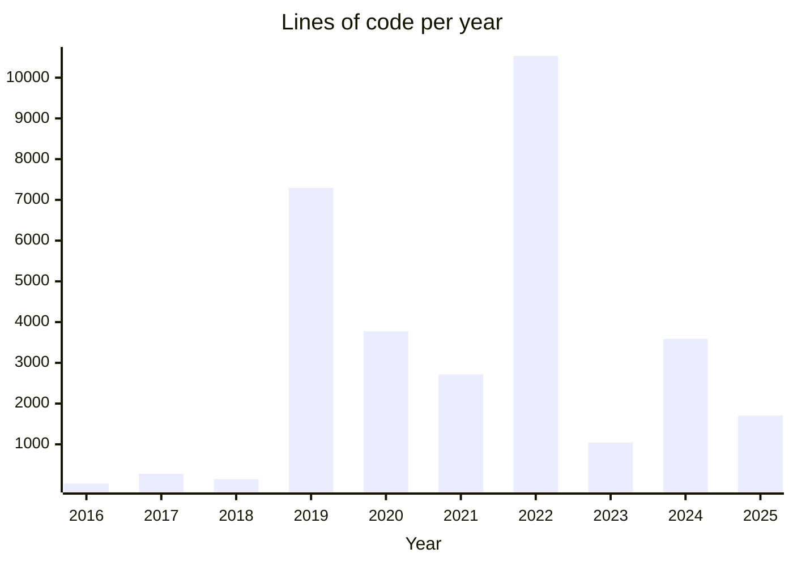

### Welcome to my profile ... 👋

My name is **Daniel Engvall**, and living in Sweden 🇸🇪 together with the rest of my family.
I use GitHub for my *personal* projects that include code and documentation, the majority of which is written in [Python](https://en.wikipedia.org/wiki/Python_(programming_language)) 🐍 together with technologies such as [Dockers](https://en.wikipedia.org/wiki/Docker_(software)), which is and has been one of my primary go-to programming languages after I've been exposed to other languages such as [Basic](https://en.wikipedia.org/wiki/BASIC), [C++](https://en.wikipedia.org/wiki/C%2B%2B), [Perl](https://en.wikipedia.org/wiki/Perl), [Pascal](https://en.wikipedia.org/wiki/Pascal_(programming_language)), and [PHP](https://en.wikipedia.org/wiki/PHP), none of them fell into my true taste. While I developed quite sophisticated solutions using [Bash](https://en.wikipedia.org/wiki/Bash_(Unix_shell)) that eventually got outgrown and I pursued a productive, dynamic, and full spectrum language to run well from anything from [microcontrollers](https://en.wikipedia.org/wiki/ESP32) and [embedded systems](https://en.wikipedia.org/wiki/Embedded_system)  (anyone ever had a [Dreambox](https://en.wikipedia.org/wiki/Dreambox) 📺..?) ..  [GUI apps](https://wiki.python.org/moin/GuiProgramming), even [mobile apps](https://kivy.org/), *web-frontend* development *(e.g. [PyScript](https://pyscript.net/))* and [statistical analysis](https://pandas.pydata.org/getting_started.html) to the scalable server application *([FastAPI](https://fastapi.tiangolo.com/) to name one of many)*. So, I have tried using **[Python](https://en.wikipedia.org/wiki/Python_(programming_language))** for the most versatile purposes. 😅👍

Also, home automation and microcontrollers (where) some of my projects found here include wiring schemes. 
Outside of my personal space, I've also used [Groovy/Java](Groovy/Java) and learned a lot from doing that.

A more recent growing passion for better understanding and writing more maintainable software using good practices and [software design](https://en.wikipedia.org/wiki/Software_design_pattern). Also had a strong devotion to documenting ideas and thoughts around those projects 🫶

Some facts about the current content are found on my GitHub - but feel free to check them out in detail over [here](https://github.com/engdan77?tab=repositories):

- During the past **9 years** have written **31119 lines of code** across **30 projects** collected here.
- Out of those projects written here, currently the **largest** ones are written with around 5k lines of code, currently at the top being [iot_fan_controller](https://github.com/engdan77/iot_fan_controller.git), [otis_service](https://github.com/engdan77/otis_service.git) and [esp32_buttons](https://github.com/engdan77/esp32_buttons.git)

This has been *<u>dynamically</u>* updated on **2025-02-23 01:41** with the help of Python and [GitHub Actions](https://docs.github.com/en/actions).

- 👀 LinkedIn profile https://www.linkedin.com/in/danielengvall/
- 📫 If you like to get in contact with me please send an email to daniel@engvalls.eu

---

